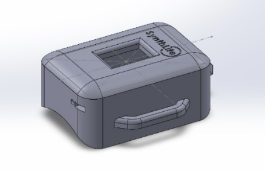

# Synthlife

Synthlife is a portable and wearable stress monitoring device we developed as first year Bio Medical Engineering Undergraduates.

## Problem Definition

We started doing a survey on 18th March 2024 regarding the problems associated with mental stress. Out of the over 100 participants who took part in our survey, about 90% of the sample are aware of mental health issues. These people belonged to several age categories, with the majority being 18 - 25 years old. The survey results indicate a significant need for a portable wearable stress monitoring device in the market. With 90% of participants aware of mental health issues and a large majority experiencing stress daily or every few days, the demand for effective stress management solutions is evident. Moreover, nearly 85% of respondents expressed interest in a device that can monitor their stress levels regularly. This data shows the growing necessity for accessible, real-time stress monitoring technology, especially among young adults, making it a crucial innovation for improving mental well-being.

## Our Solution

Our solution is a portable and wearable device designed to monitor stress levels with high accuracy. By integrating multiple advanced sensors, the device provides precise measurements of physiological indicators associated with stress. It is user-friendly, ensuring it can be comfortably worn throughout the day, making stress management both accessible and convenient. The primary goal of this device is to help mitigate the severe consequences of mental stress, such as diabetes, heart attack, depression, and even suicide. By offering real-time insights into stress levels, our product aims to enhance overall mental well-being and prevent stress-
related health issues.

### Sensor Technology

- **Heart Rate and SpO2 Sensor (MAX30100):**: This sensor is crucial for monitoring heart rate and blood oxygen saturation (SpO2), both key indicators of stress. By tracking variations in these parameters, the device can accurately assess the user’s stress levels in real time.
- **Temperature Sensor (MLX90614):**: The MLX90614 is a non-contact infrared temperature sensor that measures skin temperature, another critical factor in stress detection. Changes in skin temperature can indicate physiological responses to stress, contributing to the device’s overall accuracy.
- **Galvanic Skin Response Sensor:**: This sensor measures the electrical conductivity of the skin, which varies with sweat gland activity. Since stress typically increases sweat production, this sensor provides additional data that enhances the accuracy of stress monitoring.

## Device Overview

The proposed device to measure stress levels and vital signs based on sensor fusion is able to measure a person’s mental health (stress levels) and physical health (vital signs) simultaneously.. In this tool, the vital signs measured are oxygen saturation level (SpO2), body temperature, and heart rate. The stress level is measured by combining the galvanic skin response (GSR), body temperature, and heart rate sensor readings, which are then processed by a fuzzy logic algorithm in the microcontroller to determine the stress level. And then the determined stress level is displayed using the LCD. 

## PCB and Schematics

The PCB for this project integrates an ESP8266-12E microcontroller unit, responsible for processing sensor data and handling communication with external devices. Key sensors include the MAX30100 (for SpO2 and heart rate) and the MLX90614 (temperature sensor), interfaced through I2C lines, and a Galvanic Skin Response sensor. The board features proper power management using voltage regulators and capacitors to ensure stable operation. The design ensures minimal noise and interference, with clear separation of analog and digital traces. The compact and efficient layout facilitates easy deployment in wearable applications, making it suitable for continuous real-time monitoring of vital parameters related to stress levels.

## Enclosure Design

### Initial Sketches

The enclosure for our stress monitoring device was designed using SolidWorks to ensure precision and functionality. Leveraging SolidWorks’ advanced modeling and simulation tools, we crafted a robust design that balances durability with user comfort. The model features a sleek, contoured shape that conforms to the wearer’s body, minimizing discomfort during extended use. Through SolidWorks’ simulation capabilities, we conducted thorough stress tests and thermal analyses to ensure the enclosure withstands environmental factors and internal heat generation. The design includes effective sensor placement and user interaction. Additionally, the detailed 3D models and assemblies created in SolidWorks streamline the manufacturing process, ensuring that all components fit together seamlessly and meet high-quality standards.

